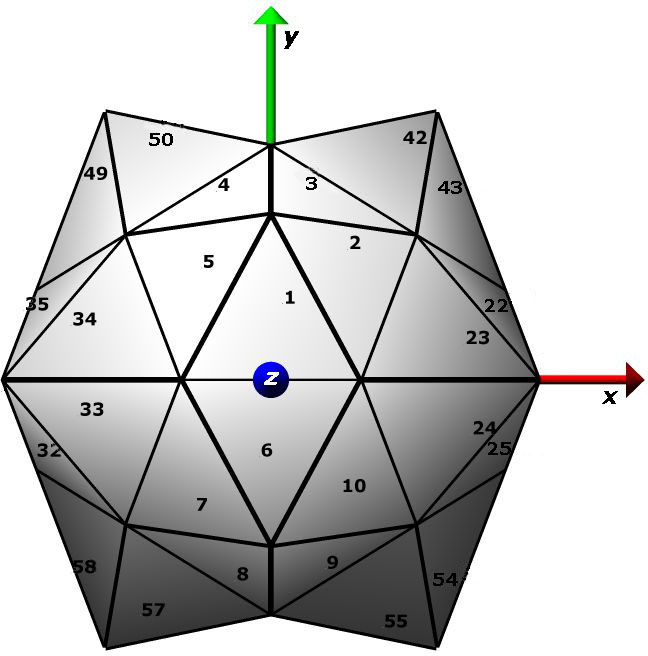

[PointSuite](https://github.com/rcsb/PointSuite) is a set of programs to process macromolecular assemblies described by point and helical symmetry operations, with the goals of uniform annotation, archiving, and viewing.  In order to handle coordinates deposited in any orthogonal Cartesian frame, the relationships between the deposition, standard point and crystal frames are captured as frame transformations.  For example, the transformation required to move icosahedral virus structures from deposited position to the standard frame shown at left is calculated and recorded.  All point symmetries are fully handled; helical entries are handled only for non-crystal cases. Written/compiled by C. Lawson, with thanks to V.J. Reddy (TSRI) for sharing PDB2VIPER code (findframe);  Tom Goddard (UCSF) for Chimera scripts (runchimera.csh); Huanwang Yang (RCSB PDB) for importmats and cif-handling subroutines. Please look at this open access article that describes how Pointsuite was used to remediate virus structures in the PDB: Lawson CL, Dutta SD, Westbrook JD, Henrick K, Berman HM (2008)   [Representation of viruses in the remediated PDB archive](http://journals.iucr.org/d/issues/2008/08/00/mv5020/index.html), Acta Cryst D, 874-882.

To INSTALL/COMPILE/CONFIGURE, view the instructions in the [PointSuite GitHub Repository](https://github.com/rcsb/PointSuite) 
  
To make full use of the package, the graphics program [UCSF Chimera](http://www.cgl.ucsf.edu/chimera/) should be installed and in your path.  
  
DEMO TESTING:  
```
cd demo
```
to run the demo for 1RUG:
```
rundemo.csh 1RUG
```
to run all of the demos:
```
rundemo.csh all
```

  
browse the demos to view functionality  
  1RUG: Generate archival cif for icosahedral virus crystal structure.  
  1IFD:   Generate archival cif for helical virus fiber diffraction structure.  
  1EI7:   Generate archival cif for D17 symmetry particle.  1CGM:  Generate matrix representation for ~900 A length helical TMV-like virus.  
  1M4X:  Generate matrix representations for complex virus particle sub-assemblies.  
  IMPORT:  Generate BIOMT, CIF from typical author-uploaded example input files using importmats.  
Additional icosahedral virus examples: 2XD8 (EM), 2W0C, 2VF9, 3N7X (X-ray).   
    
- - -

PROGRAM DOCUMENTATION:  

*   [FINDFRAME](#program-findframe)
*   [POINTMATS](#program-pointmats)
*   [MAKEASSEMBLY](#program-makeassembly)
*   [Utilities](#utilities)
    *   [importmats](#importmats)
    *   [autoscripts](#autoscripts)          
    *   [frac2orth](#frac2orth)
    *   [movecoords](#movecoords)
    *   [multiplymats](#multplymats)

  
*    [Virus Processing Tutorial](virusproc-tutorial.md)
        
- - -

## <a name="program-findframe"></a>PROGRAM FINDFRAME

### Description

The program FINDFRAME calculates the transformation matrix that moves the asymmetric unit of a particle with point symmetry in an arbitrary (skew) frame into a defined position within a standard point frame.  The standard icosahedral frame is defined as having the 5-fold axis of the first pentamer centered on the vector (x=0,y=1, z=phi), where phi is the golden ratio (sqrt(5)+1)/2.  This convention is also employed by the VIPER database and the is proposed convention of Belnap et. al. for cryoEM maps.  

FINDFRAME is an extension of the [PDB2VIPER](http://viperdb.scripps.edu/pdb2viper.php) program from the VIPERdb (Shepherd, et al. (2006) Nucleic Acids Res, 34, D386-389) that incorporates the qikfit least-squares fitting routine from [Bioplib](http://www.bioinf.org.uk/software/profit/index.html) (A.C.R. Martin, personal communication). Algorithm steps have been added to increase the precision of the calculated transformation matrix and to improve uniformity of coordinate placement relative to the standard icosahedron symmetry axes (see description below).  
  

### Use

on the command line:  
  
\>findframe infile.pdb/cif

The input file is expected to have all needed transformation matrices to build the icosahedral or other point group particle AND coordinates for the asymmetric unit .  PDB matrices can be given either as REMARK 350 BIOMT or MTRIX records; in cif the matrices are given in \_pdbx\_struct\_oper\_list and must have type of "general operation", "point symmetry operation" or "helical symmetry operation".  One of the transformation matrices must be the identity element. Optional: a second file can be provided with BIOMT records; in this case the matrices in the 2nd file override any present in the first file.  
  

### Algorithm

modifications to PDB2VIPER (from V.J. Reddy) are in italics

1.  The approximate center of mass ("reference atom") is calculated from Calpha and P atom positions.
2.  The set of matrix translation vectors are averaged to find the center of the particle relative to the coordinate origin. The reference atom is translated by the negated particle center and transformed into a unit vector.
3.  The rotation matrices are decomposed into angle-axis form. The angle identifies the fold of the rotation (e.g. 72 or 144 degrees for 5-fold, 120 degrees for 3-fold). The axis vector defines the symmetry orientation. 
4.  The rotations are checked against their corresponding translation vectors to identify helical symmetry.  If helical symmetry is detected, then the program attempts to identify all of the helical parameters from the matrices, and will print this info to findframe.cif and will then exit (currently, program only handles cases with helical axis on z).  
    
5.  If no helical operations are detected, then point symmetry is assumed and the program analyses the matrices to deduce the correct symmetry.  The remainder of the algorithm description explains what happens for icosahedral symmetry, but essentially similar steps are taken for the other symmetries (circular,dihedral, tetrahedral, octahedral).  
    
6.  The five-fold, two-fold, and three-fold closest to the reference atom are identified.  
    
7.  _The position of the reference atom unit vector relative to the 5-3 and 5-2 planes is evaluated.  If the reference atom is closer to the 5-3 plane, the icosahedral a.u. is classified as "3-fold centric" and the closest 3-fold is selected for alignment in the next step.  If the reference atom is closer to the 5-2 plane (typically true for T=3 viruses), the icosahedral a.u. is classified as "2-fold centric" and the 3-fold to the right of the 2-fold is selected for alignment._
8.  The  input structure's 5-fold and 3-fold are aligned onto the standard icosahedral frame 5-fold (0, 1, phi) and 3-fold (phi/3, 0, (2\*phi+1)/3) axes in two steps.  First, the rotation that superimposes the normal to the 5-3 plane of the deposited structure onto the normal to the 5-3 plane of the standard icosahedron 5-fold is found and applied.  Second, the rotation around the aligned normals that superimposes the pair of 5-fold axes is found and applied.  The initial estimate for the findframe matrix is based on these two rotation matrices and the translation vector determined in step 2.
9.  _Fitting/refinement: The input-supplied transformations are applied to the reference atom, and the resulting 60-atom constellation is transformed to the icosahedral frame by the initial findframe matrix.  A reference set is generated by applying icosahedral symmetry operations to the 1st  transformed atom.  The 60-atom constellation is fitted to the icosahedral reference set, yielding a correction matrix.  The final findframe matrix is generated by applying the correction matrix to the initial estimate.  This step is particularly helpful for cases where the input file-supplied matrices have either low precision or small random errors, as these errors tend to be averaged out._
  

### Output

General info about the calculation is provided in the standard output.  On successful execution a cif file with symmetry and frame transformation info is  also output called \*findframe.cif\*.   

- - -

## <a name="program-pointmats"></a>PROGRAM POINTMATS  

### Description

Generates sets of transformations corresponding to point or helical symmetry provided in the input cif file ( \_pdbx\_point\_symmetry, \_pdbx\_helical\_symmetry).   If the input cif contains a "transform to point frame" matrix with \_pdbx\_struct\_oper\_list.id labelled 'P' (or a "transform to helical frame" matrix is given with \_pdbx\_struct\_oper\_list.id labelled 'H'), the matrix set is transformed such that it can be applied to coordinates away from the standard frame, e.g., \[P-inv\]\[std mats\]\[P\].  Use pointmats to obtain simple matrix set output files for point/helical symmetry operations; use makeassembly if you need full assembly and asymmetric unit descriptions.  

  

### Use

Commonly used after findframe, e.g.:  
  
pointmats findframe.cif  
  
will generate point or helical matrix set with standard order in the same frame as the matrices analysed by findframe.  

  

### Output

General info about the calculation is provided in the standard output; the matrices are written in CIF format to pointmats.cif and in BIOMT format to pointmats.biomt.  Point symmetry operations follow a standard order.  Helical symmetry operations are given as a continuous run centered around the identity element.  

- - -

## <a name="program-makeassembly"></a>PROGRAM MAKEASSEMBLY  

### Description

The set of point symmetry operations corresponding to a crystal asymmetric unit is identified, given the following input: CIF file with unitcell, spacegroup, asym\_id, entity\_id records ,  cif with \_pdbx\_point \_symmetry or \_pdbx\_helical\_symmetry and \_pdbx\_struct\_oper\_list with frame transformations (P for "transform to point frame" ; H for "transform to helical frame"; X0, X1, etc. for "transform to crystal frame").  The program will analyse the structure for ncs only if at least one "transform to crystal frame" matrix is given (X0) (this will frequently be the identity matrix). FROM v.5.7 onward, makeassembly outputs asym\_id lists instead of author\_asym id list.  

### Use

Crystal frame transformations are optional (e.g., for EM structures):  

\>makeassembly uc\_symtry\_scale\_.cif symm\_transforms.cif  

### Algorithm  

1.  For each independent particle position n defined by Xn, the full standard set of matrices for the point symmetry given in 2ptmat , \*\*to be applied to coordinates transformed by X0\*\*,  are calculated as \[Xn\]\[2ptmat^-1\]\[StdMats\]\[2ptmat\]\[X0^-1\].
2.  The crystal symmetry matrices in their fractional forms are transformed by the translation part of \[Xn^-1\].   This moves the origin of the crystal lattice to the particle center.   Crystal symmetry operators passing through the particle center are identified by lack of fractional translation components (full unit translations are reset to 0).
3.  Each crystal symmetry rotation identified in step 2 is applied to each of the rotations calculated in step 1.  Symmetry-transformed rotations that are identical to untransformed rotations with lower index are eliminated from the list of ncs operations.

### Output

General info about the calculation for each independent particle is provided in the standard output; an archival cif (assembly.cif) is generated, as well as biomt records for the full assembly (assembly.biomt).  For crystal structures a bare-bones crystal frame pdb file is created that can be input to sfcheck or packing programs (assembly\_xframe.pdb), and ncs records are generated (assembly.ncs).  

- - -

## Utilities

- - -

### importmats:  

call with  
\>importmats matfile  
  
Reads in and automatically detects a wide variety of  matrix record formats including BIOMT, MTRIX, ncs.def.  
Outputs file with BIOMT records named "importmats.biomt" and file with CIF \_pdbx\_struct\_assembly\_oper records named "importmats.cif"  
Use importmats to prepare author.biomt file for runpt.csh  

- - -

### autoscripts:  

(1) make assembly cif records:  
runpt.csh (prints out instructions for preparing script arguments)  
runpt.csh entry.cif  author-upload-matfile (noncrystal and most crystal structures)  
runpt.csh entry.cif author-upload-matfile X0.mat (crystal out of frame or multiple positions in crystal a.u.)  
(2) makes pictures of files generated by runpt.csh:  
runchimera.csh  
(3) makes pictures from PDB file ready for release:  
RCSBvirusimages.csh file1.pdb  
RCSBvirusimages-split.csh  file1.pdb file2.pdb file3.pdb ... (combined images for split entries)  

- - -

### frac2orth:  

call with  
\>frac2orth  
  
Interactively requests 6 parameters of unit cell and a position in fractional coordinates, outputs orthogonalization matrix, fractionalization matrix, and corresponding Cartesian coordinates of input position.  Useful if the translation part of a skew matrix is provided in fractional coordinates.  

- - -

### movecoords: 

call with  
\>movecoords file1.pdb file2.matrix  
  
reads in pdb file and 4x4 matrix file, writes out "new.pdb" file that is identical to input file except with x,y,z coordinates tranformed by the 4x4 matrix.  

- - -

### multiplymats:  

Performs complex matrix multiplications given a list of matrices in cif format and a string defining the desired multiplication.  
String can include numerical ranges and recursion.  
examples:  
"(1-2)(3,5,7-9)"  creates the set of matrices 1\*3, 1\*5, 1\*7, 1\*8, 1\*9, 2\*3, 2\*5, 2\*7, 2\*8, 2\*9  
"(1)(2,(2)(2),(2)(2)(2))" creates the set of matrices 1\*2, 1\*2\*2, 1\*2\*2\*2  

call with  
\>multiplymats <pointmats or assembly cif> <matrix multiplication string in double quotes>  

example (1m4x):  
multiplymats 1m4x.cif "(1-60)(61-88)"  
number of matrices read: 89  
Matrix multiplication expression to be parsed: (1-60)(61-88)  
  
result:  
  
1\*61  
1\*62  
1\*63  
1\*64  
1\*65  
1\*66  
1\*67  
1\*68  
1\*69  
1\*70  
1\*71  
...

60\*85  
60\*86  
60\*87  
60\*88  
Writing 1680 matrices to \*mult.cif\*  
Writing 1680 matrices to \*mult.biomt\*  
  

- - -

last modified 21 Aug 2024 C. Lawson
